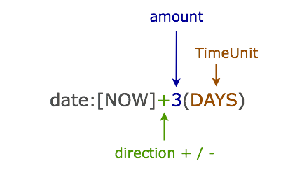
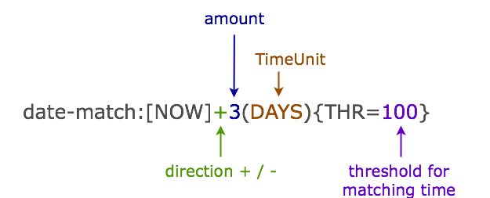

:toc: preamble
:sectnums:

# Spring Test MongoDb

image:https://travis-ci.com/jupiter-tools/spring-test-mongo.svg?branch=master["Build Status", link="https://travis-ci.com/jupiter-tools/spring-test-mongo"]
image:https://sonarcloud.io/api/project_badges/measure?project=com.antkorwin%3Aspring-test-mongo&metric=coverage[]

Tools to write integration tests of applications with a MongoDb persistence layer and Spring Framework.

## Introduction

SpringTestMongo is a tool to write integration tests on systems which
used the MongoDB as a data storage.
This library provides you an ability to run your tests with the docker
image of MongoDB (by the use of Testcontainers).

Also, spring-test-mongo allows you to write tests in a more pragmatic
manner using annotations and extension for JUnit5.
Also, this library supports the JUnit4 by the using a Rule approach.
You can use JSON files to prepare the state of a database
or to check this state after some activities (update, delete e.t.c).

## Getting started

You need to add the next dependency:

[source, xml]
----
<dependency>
    <groupId>com.jupiter-tools</groupId>
    <artifactId>spring-test-mongo</artifactId>
    <version>0.14</version>
    <scope>test</scope>
</dependency>
----

## JUnit5 integration test

Let's look at the example of using the TestContainers library to make integration tests.
And the JUnit5 extension to make your tests more pragmatic and elegant.

[source, java]
----
@MongoDbIntegrationTest <1>
class JUnit5ExampleTest {

    @Autowired
    private MongoTemplate mongoTemplate;

    @Test
    @MongoDataSet(value = "/dataset/bar_dataset.json")  <2>
    void testPopulatingByMongoDataSet() throws Exception {

        Bar simpleDoc = mongoTemplate.findById("55f3ed00b1375a48e618300b", Bar.class);  <3>

        Assertions.assertThat(simpleDoc)
                  .isNotNull()
                  .extracting(Bar::getId, Bar::getData)
                  .containsOnly("55f3ed00b1375a48e618300b", "BB");
    }
}
----
<1> This annotation runs MongoDB instance by the use of Testcontainers library
and turn on SpringTestMongo which able you to use DataSets in tests
<2> Initialize the state of the database from JSON file before the test execute
<3> Read data from the MongoDB instance which started by the MongoDbIntegrationTest annotation

Let's look at the file with a data-set(`bar_dataset.json`):

[source, json]
----
{
  "com.antkorwin.springtestmongo.Bar": [
    {
      "id": "55f3ed00b1375a48e618300a",
      "data": "A"
    },
    {
      "id": "55f3ed00b1375a48e618300b",
      "data": "BB"
    }
  ]
}
----

## JUnit4 integration test

Also, you can use the JUnit4 rule and the base abstract class
to write integration tests in the old-style (with the use of the JUnit4 and inheritance in tests)

[source, java]
----
public class JUnit4ExampleTest extends BaseMongoIT {

    @Test
    @MongoDataSet(value = "/dataset/multidocument_dataset.json")
    public void testPopulatingByMongoDataSet() throws Exception {

        Bar simpleDoc = mongoTemplate.findById("55f3ed00b1375a48e618300b", Bar.class);

        Assertions.assertThat(simpleDoc)
                  .isNotNull()
                  .extracting(Bar::getId, Bar::getData)
                  .containsOnly("55f3ed00b1375a48e618300b", "BB");
    }
}
----

## Importing datasets before test execution

`spring-test-mongo` provides you an ability to import initial data in the
MongoDB database before starting a test execution.
You can describe this dataset as a JSON file with an array of MongoDB documents.

For example we consider a simple document class:

[source, java]
----
@Document
public class Foo {
    @Id
    private String id;
    private Date time;
    private int counter;
}
----

Let's look at the dataset file (`foo-init.json`) with a pare instances of this class:

[source, json]
----
{
  "com.antkorwin.springtestmongo.Foo": [  <1>
    {
      "id": "77f3ed00b1375a0000000001",
      "time":1516527720001,
      "counter":1
    },{
      "id": "77f3ed00b1375a0000000002",
      "time":1516527720002,
      "counter":2
    }
  ]
}
----
<1> full class-reference of populated document collection

Now we can write an integration test which will init the database from this file:

[sourcem java]
----
@Test
@MongoDataSet(value = "/dataset/foo-init.json")  <1>
void testImportByMongoDataSetAnnotation() {
    // Act
    Foo fooDoc = mongoTemplate.findById("77f3ed00b1375a0000000001", Foo.class);
    // Assert
    Assertions.assertThat(fooDoc)
              .isNotNull()
              .extracting(Foo::getCounter, Foo::getTime)
              .containsOnly(1, new Date(1516527720001L));
}
----
<1> Annotation MongoDataSet initialize the state of MongoDb from JSON file before the test execution

### Multiple document types in one dataset

If you need to populate different documents collection before execution one test
then you can write multiple arrays of necessary types in a dataset:

[source, json]
-----
{
  "com.antkorwin.springtestmongo.Bar": [  <1>
    {
      "id": "55f3ed00b1375a48e618300a",
      "data": "A"
    },
    {
      "id": "55f3ed00b1375a48e618300b",
      "data": "BB"
    }
  ],
  "com.antkorwin.springtestmongo.Foo": [  <2>
    {
      "id": "77f3ed00b1375a48e618300a",
      "time":1516527720000,
      "counter":1
    }
  ]
}
-----
<1> first document array
<2> second document array

### Nested documents

You can describe nested objects in your dataset.
Let's look at the the next model:

[source, java]
----
@Data
@Document
public class FooBar {
    @Id
    private String id;
    private String data;
    private Bar bar;  <1>
}

@Data
@Document
public class Bar {
    @Id
    private String id;
    private String data;
}
----
<1> nested object with another type

so, you can describe a dataset for this example as shown below:

[source, json]
----
{
  "com.jupiter.tools.spring.test.mongo.FooBar" : [ {
    "id": "55f1dd90a1246a44e118300b",
    "data" : "TOP LEVEL DATA",
    "bar": {
      "id": "88f3ed00b1375a48e619900c",
      "data":"NESTED DATA"
    }
  }]
}
----

### Date and time in dataset

To set a date and time value in a field you can use
the next syntactic construction:

For example if you need tomorrow you can use this pattern: `[NOW]+1(DAYS)`,
if you need a time value of three minutes ago: `[NOW]-3(MINUTES)`.

Value of these fields will be prepare before run the test.

[#groovy-scripting]
### GroovyScript in datasets

To use Groovy scriptable datasets you need to add the next dependency:

[sourcce, xml]
----
<dependency>
    <groupId>org.codehaus.groovy</groupId>
    <artifactId>groovy-all</artifactId>
    <version>2.4.6</version>
    <scope>test</scope>
</dependency>
----

Let's look at the next document:

[source, java]
----
@Document
public class Task {

    @Id
    private String id;
    private String title;
    private int estimate;
    private Date createTime;
}
----

You can write groovy scripts in the values of fields:

[source, json]
----
{
  "com.antkorwin.springtestmongoexamples.model.Task": [
    {
      "id": "55f3ed00b1375a48e618300a",
      "title": "black magic",
      "estimate": "groovy: (1..5).sum()",
      "createTime": "groovy: new Date(12345)"
    }
  ]
}
----

Values of these fields will be evaluated before populate data set in the database.
And you can write the next test with expected values of this fields:

[source, java]
----
@Test
@MongoDataSet(cleanBefore = true,  <1>
              cleanAfter = true,   <2>
              value = "dataset/init_task_groovy.json")
void groovyInitTest() {
    Task task = taskService.get("55f3ed00b1375a48e618300a");
    assertThat(task).extracting(Task::getEstimate, Task::getCreateTime)
                    .contains(1 + 2 + 3 + 4 + 5, new Date(12345));
}
----
<1> drops all collection before populate a dataset
<2> clean database after the test execution

### JavaScript in datasets

Unlike Groovy scripts, Javascript comes by default in JDK and you
don't need some extra dependencies to work with JavaScript.

Let's consider the next simple document class:

[source, java]
----
@Document
public class Bar {
    @Id
    private String id;
    private String data;
}
----

and make the dataset file `javascript-dataset.json`:

[source, json]
----
{
   "com.antkorwin.springtestmongo.Bar": [
     {
       "id": "55f3ed00b1375a48e618300a",
       "data": "js: 2+3"
     }
   ]
}
----

And now we expecting a successful result of this test:

[source, java]
----
@Test
@MongoDataSet(value = "javascript-dataset.json")
public void jsDataset() throws Exception {

    Bar simpleDoc = mongoTemplate.findById("55f3ed00b1375a48e618300a", Bar.class);

    Assertions.assertThat(simpleDoc)
              .isNotNull()
              .extracting(Bar::getData)
              .containsOnly(5);
}
----

### Immutable data set

If you need to assert that data in the mongodb do not change after
test execution then you can use parameter `readOnly` in the annotation
`MongoDataSet` as you can see below:

[source, java]
----
@Test
@MongoDataSet(value = "/dataset/foo-init.json", readOnly = true)
void testImportByMongoDataSetAnnotation() {
    Foo fooDoc = mongoTemplate.findById("77f3ed00b1375a0000000001", Foo.class);
    // if you change data in MongoDB here, then this test will fail.
}
----

## Expecting the state of the database after a test execution

`spring-test-mongo` provides you an ability to declare dataset that you
expect in MongoDB after test execution.

Let's try to use it by the testing creation of new Task:

[source, java]
----
@Test
@ExpectedMongoDataSet("dataset/create_task_expected.json")
void create() {
    mongoTemplate.save(new Task("black magic", 123));
}
----

content of the expected dataset:

[source, json]
----
{
  "com.antkorwin.springtestmongoexamples.model.Task": [
    {
      "title": "black magic",
      "estimate": 123
    }
  ]
}
----

### Using regular-expressions in datasets

Annotation ExpectedDataSet provide you an ability
to use regular expressions in JSON datasets. For example you can
describe expected field as: `regex: ^data-.$`

Let's look at the dataset of ContactInfo documents:

[source, json]
----
{
  "com.antkorwin.springtestmongoexamples.model.ContactInfo": [
    {
      "title": "e-mail",
      "value": "regex: \\S+@\\S+\\.\\S+$"  <1>
    }
  ]
}
----
<1> using regex to check email value from database

### Date & Time matching

It works the same as import dataset but
need to use prefix `date-match:` instead od `date:`
in the expected value of fields:

[source,java]
----
{
  "com.antkorwin.springtestmongo.Foo": [
    {
      "time": "date-match:[NOW]",
      "counter" : 1
    },
    {
      "time":"date-match:[NOW]+3(MINUTES)",
      "counter" : 2
    }
  ]
}
----

Now we can run this test:

[source, java]
----
@Test
@ExpectedMongoDataSet("dataset/expect_with_dates.json")
void dateTimeNow() {
   Date now = new Date();
   Date plus3min = new Date(now.getTime() + TimeUnit.MINUTES.toMillis(3));
   mongoTemplate.save(new Foo(now, 1));
   mongoTemplate.save(new Foo(plus3min, 2));
}
----

Date matching checks time with a threshold value, and you can set amount of this
threshold in the date-matcher like this: `date-match:[NOW]+25(SECONDS){THR=0}`
By default threshold value is 10 000 milliseconds.

You can see syntactic of the match date pattern on the picture above.

### JavaScript matching

You can use javascript in expected datasets:

[source, json]
----
{
  "com.antkorwin.springtestmongo.Foo": [
    {
      "counter" : 17
    },
    {
      "counter" : "js-match: value % 2 == 0"  <1>
    }
  ]
}
----
<1> javascript expression expected even value in database

[source, java]
----
@Test
@MongoDataSet(cleanBefore = true, cleanAfter = true)
@ExpectedMongoDataSet("js_match.json")
void matchJavaScript() {
    mongoTemplate.save(new Bar(17));
    mongoTemplate.save(new Bar(32));
}
----

### Groovy matching

Also, you can use groovy scripts for matching values after a test execution.
To work with groovy you need to add it in dependencies (see <<groovy-scripting>> section)

[source, json]
----
{
  "com.antkorwin.springtestmongo.Foo": [
    {
      "counter" : "groovy-match: value == 10+7"
    },
    {
      "counter" : "groovy-match: value == (1..10).sum()"
    }
  ]
}
----

and now we can run this test:

[source, java]
----
@Test
@MongoDataSet(cleanBefore = true, cleanAfter = true)
@ExpectedMongoDataSet("js_match.json")
void matchJavaScript() {
    mongoTemplate.save(new Bar(17));
    mongoTemplate.save(new Bar(55));
}
----

## Use GeoJson in data sets

With this library you can use different GeoJson data types in
your tests. Let's consider the next document:

[source, java]
----
@Document
public class StarShip {
    @Id
    private String id;
    private String name;
    private int armor;
    private int damage;
    private GeoJsonPoint location;
    private GeoJsonPolygon shape;
}
----

### Export GeoJson data after tests execution in the dataset

When you use `@ExportMongoDataSet` annotation in tests
then documents from the database will be serialized
to the target file in a next way:

[souce, json]
----
{
  "com.jupiter.tools.spring.test.mongo.documents.StarShip": [
    {
      "id": "5cbbff29921376648d6f4e81",
      "name": "Dreadnought",
      "armor": 100,
      "damage": 50,
      "location": {
        "type": "Point",
        "coordinates": [20.0, 40.0]
      },
      "shape": {
        "type": "Polygon",
        "coordinates": [
          [
            [20.0, 40.0],
            [22.0, 42.0],
            [22.0, 40.0],
            [20.0, 42.0]
          ]
        ]
      }
    }
  ]
}
----

example of the test with the exporting dataset:

[source, java]
----
@Test
@ExportMongoDataSet(outputFile = "target/dataset/export.json")
void exportPolygon() {

    Point p1 = new Point(20, 40);
    Point p2 = new Point(22, 42);
    Point p3 = new Point(22, 40);
    Point p4 = new Point(20, 42);

    StarShip dreadnought = StarShip.builder()
                                   .name("Dreadnought")
                                   .armor(100)
                                   .damage(50)
                                   .location(new GeoJsonPoint(20, 40))
                                   .shape(new GeoJsonPolygon(p1, p2, p3, p4))
                                   .build();

    mongoTemplate.save(dreadnought);
}
----

### Expected GeoJson in the data set

Let's look at the sample of the searching an object in MongoDB within the (GeoJson) rectangle boundary:

[source, java]
----
@Test
@MongoDataSet(value = "dataset/geo/geo_within.json")
void findWithinRectangle() {
    // Act
    GeoJsonPolygon boundary = new GeoJsonPolygon(new Point(0, 0),
                                                 new Point(10, 0),
                                                 new Point(10, 10),
                                                 new Point(0, 10),
                                                 new Point(0, 0));

    Query query = new Query();
    query.addCriteria(Criteria.where("location")
                              .within(boundary));
    // Act
    List<StarShip> ships = mongoTemplate.find(query, StarShip.class);

    // Assert
    assertThat(ships).hasSize(1);
    assertThat(ships.get(0).getName()).isEqualTo("x-wing");
}
----

we used a next data set with two objects in the file `dataset/geo/geo_within.json` :

[source, json]
----
{
  "com.jupiter.tools.spring.test.mongo.documents.StarShip": [
    {
      "id": "5cbaa745921376602705886f",
      "name": "x-wing",
      "location": {
        "type": "Point",
        "coordinates": [
          1.0,
          5.0
        ]
      }
    },
    {
      "id": "5cbaa74592137660270588ff",
      "name": "falcon",
      "location": {
        "type": "Point",
        "coordinates": [
          15.0,
          10.0
        ]
      }
    }
  ]
}
----

